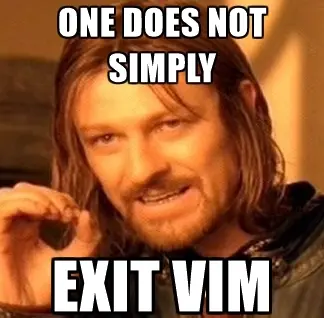

---
theme:
  name: tokyonight-storm
  override:
    default:
      headings:
        h1:
          prefix: "██"
          colors:
            foreground: "rgb_(48,133,195)"
        h2:
          prefix: "▓▓▓"
          colors:
            foreground: "rgb_(168,223,142)"
        h3:
          prefix: "▓▓▓▓"
          colors:
            foreground: "rgb_(51,153,255)"
---

Getting started with Vim and Tmux
========================================

<!-- column_layout: [1, 1]-->

<!-- column: 0 -->

<!-- new_lines: 3 -->


<!-- column: 1 -->

<!-- new_lines: 10 -->


<!-- reset_layout -->

Attn: VSCode/Other IDE users
========================================

Although we'll be using `vim` directly in this workshop, there are plugins that 
emulate pretty much everything we'll be doing in VSCode 🚀

Getting setup
========================================

**🚧 You must have `docker` installed to run this workshop 🚧**

```bash
git clone https://github.com/rhart92/intro-to-vim-tmux
cd intro-to-vim-tmux

# Should take about 2 minutes to build initially
./build

./run
```
> Thanks @beau for helping me test this!

What is vim?
========================================

What is vim?

A text editor created by Bram Moolenaar in 1991 which improved on Bill Joy's 
work on `vi` (which stood for Visual Editor as it was one of the first text 
editors to provide a visual interface) in the 1970s.

From the docs:

**Vim** is a greatly improved version of the good old UNIX editor Vi.
**Neovim** is a Vim fork focused on extensibility and usability.

> 💡 Throughout this workshop, we'll be using Neovim but we're not going to 
learn anything specific to Neovim.

Why is it useful to learn Vim?
========================================

Many remote linux systems (e.g. `utility`) already have `vi` / `vim` installed 
on them so if you're trying to edit files on remote systems, it's a good bet 
`vim` will be there.

Vim's modal editing also provides a lot of power for text manipulation. More on 
this later.

Vim (and even more so Neovim) is extremely customizable and the customization is 
reasonably approachable. I'm not talking about just changing fonts, colors, etc 
but you can pretty easily write your own mini plugins.

Vim is obviously run via the command line and it integrates well with existing 
shell tools as we'll see.

Opening Vim
========================================

To launch `vim`, you can use it similar to `cat` or the `code` command VSCode 
users are familiar with.

- `vim [FILES]`
- `nvim [FILES]`

> 💡 Our workshop docker image has `vim` aliased to `nvim` for ease.

<!-- pause -->

[Exercise] Everyone open `notion.txt` in vim.

Quitting Vim
========================================



Ok but seriously... how do I quitting Vim
========================================

To quit we need to enter command mode (we'll talk a bit more about what this 
means later). To do this, press `:`. 

- The quite command is `:q` short for `:quit`
- If you've made any changes and haven't saved, then you'll need to use `:q!` to 
make sure Vim knows you're serious 😅

> Once we learn how to make changes, we'll come back to saving.

What is a modal editor?
========================================

Vim has a bunch of modes:
- Normal
  - Moving around your file
  - Manipulating text (without typing characters directly)
- Visual
  - Selecting text
- Insert
  - VSCode's editor
- Command-line
  - Useful for issues commands to vim **(we'll touch on this but not a ton)**

Modes we're not going to talk about:
- Select ❌
- Ex ❌
- (and new to Neovim) Terminal ❌

Normal mode
========================================

Normal mode is where you'll do most of your navigation and text manipulation.

The most basic thing you can do in vim is single character movement:

- `k` to move up
- `j` to move down
- `h` to move left
- `l` to move right

Practice movement
========================================

Exercise: Launch `vim maze.txt`. Your goal is to use the above keys to navigate 
the maze from `S` to `E`.

```
S  +++++++++++++
            +  +
+  +++++++  +  +
+        +     +
+  +++++++++++++
+        +     +
+++++++  +  ++++
+              +
+  +++++++  ++++
+        +     E
+++++++++++++ 
```

Fuzzy finding files
========================================

> As we start to change modes, this will only work in normal mode. If you're 
ever not sure if you're in normal mode you can either hit `Esc` and you'll then 
be in normal mode or you can look in the bottom left of the screen and you 
should see the name of the mode you're in.

You can open a fuzzy file finder by pressing `<Space>`, then `s` for search, and 
`f` for files. In the dialog that opens, you can start typing the name of the 
file you want to open and then hit enter.

> 💡 Unlike in many other programs, vim allows you to bind commands to a 
sequence of key presses.

Exercise: Open `notion.txt` again but this time use the fuzzy finder.

Insert mode
========================================

To enter insert mode, press `i`. This will put you in insert mode **before** the 
character your cursor was on.

```
  Cursor
    v
Hello, world!

Pressing `i` will put you in insert mode before the `o`.
```

Alternatively you can press `a` to enter insert mode after the character your 
cursor was on.

Inserting characters at the start / end of a line
========================================

It's common that you want to insert not where your cursor is but at the start or 
end of the current line.

For this you can use `I` to insert at the start and `A` to insert at the end.

To leave insert mode and return to normal mode, press `Esc`

Let's practice by opening `counting.md` and following the instructions.

Counting.md
========================================

<!-- column_layout: [1, 1]-->

<!-- column: 0 -->

# Before

```markdown
# Fill in the missing values

## Count to 10

2 3 4 5 7 9

## Count from 20 to 25

20 22 23
```
<!-- column: 1 -->

# After

```markdown
# Fill in the missing values

## Count to 10

1 2 3 4 5 6 7 8 9 10

## Count from 20 to 25

20 21 22 23 24 25
```

<!-- reset_layout -->

Saving in Vim
========================================

Ok let's save our changes to `counting.md`.

- `:w` to save the current buffer
- `:wq` to save the current buffer and quit
- `:wa` to save all open buffers

Adding new lines quickly
========================================

- `o` to enter insert mode on the next line
- `O` to enter insert mode on the previous line

Finding text
========================================

- `/foo` to search for `foo`
- `n` to go to the next occurrence
- `N` to go to the previous occurrence

You can also do cool regex stuff if you're into that stuff.

Replacing text
========================================

Vim's main find + replace command is `:s` which stands for substitute.

The syntax for command looks like:

- `:%s/<find_string>/<replacement_string>/<options>`

Breaking this down:

- `:` to enter command mode
- `%` to apply the command to the whole file
- `s` to substitute
- `/` to separate the parts of the command
- `<find_string>` the string you want to find
- `/` to separate the parts of the command
- `<replacement_string>` the string you want to replace it with
- `/` to separate the parts of the command
- `<options>` to affect how the find is performed

Replacing text
========================================

Exercise: Open `demo.md` and replace all instances of `Foo` with `Bar`.

Syntax: `:%s/<find_string>/<replacement_string>/<options>`

## Options
- `c` confirm each replacement.
- `g` replace all occurrences on a line, not just the first

> Checkout Abolish.vim for smart case find and replace.

Visual mode
========================================

Visual mode is useful for selecting text.

There are 3 distint types of visual selections.

- `v` to enter visual mode
- `V` to enter visual line mode
- `Ctrl-v` to enter visual block mode

When selecting text in visual mode, under the hood what you're doing is defining 
a range. Then you can perform operations on that range.

> We don't have time to cover this fully but next we'll see some examples of 
where ranges are used.

Utilizing shell commands with Vim content
========================================

Vim has a bunch of ways to interact with the shell but the one I use the most 
is:

- `:<range>!` to run shell commands using a range of content in Vim

which allows you to filter a range of text through a shell command.

Formating JSON using `jq`
========================================

Exercise: Open `block.json` and we'll use `jq` to format the JSON.

The command we're going to run is:

- `:%!jq .`

Breaking this down:

- `:` to enter command mode
- `%` to apply the command to the whole file
- `!` to run a shell command
- `jq .` to run `jq` with the `.` argument

- `:r !` to read output of shell commands into your buffer

More useful motions
========================================

- `w` to move to the start of the next word
- `b` to move to the start of the previous word
- `gg` to move to the start of the file
- `G` to move to the end of the file

Actions
========================================

- `d` to delete
- `c` to change
- `y` to yank (copy)
- `p` to paste

> Don't have time here, but vim has it's own built in copy paste registers. You 
can configure to use the system clipboard if you want.

Actions with Motions
========================================

- `d`, `c`, `y` with motions
- Pressing these twice to do line wise operations

Demo: Deleting words, lines, etc.

Changing numbers
========================================

- `Ctrl-a`, `Ctrl-x`

Moving around
========================================

- `Ctrl-o` and `Ctrl-i` to move back and forward in the jump list
- `Ctrl-d` and `Ctrl-u` to move down and up half a page
- `zz` to center the screen on the cursor

Friendly Manual
========================================

- `:tutor` to open vimtutor
- `:h` to open help
- Or if you have telescope you can `<leader>fh`

Intro to Tmux
========================================

Tmux is a terminal multiplexer.

This means you can have multiple terminal sessions in a single terminal window.

It also allows you to have multiple concurrent sessions running which makes it 
super convinient for development on multiple projects.

Disclaimer
========================================

All of these keybindings are customizable if you don't like them or they don't 
make sense to you. As you'll see in the following slides, I've customized some
of the keybindings to make them easier to remember.
 
Launching tmux
========================================

To launch tmux, you can simply type `tmux` in your terminal.

```
tmux
```

Tmux Concepts
========================================

- Sessions -- a collection of windows
- Windows (e.g. tabs at the bottom) -- a collection of panes
- Panes (e.g. splits) -- a section of the terminal

Demo moving around projects.

Tmux prefix
========================================

Tmux has a prefix key which is `Ctrl-b` by default.

> I find this awkward to type, so for this workshop it's `Ctrl-g` but you can 
set this to whatever you want.

To send a command to tmux, you must first "send" the prefix.

Tmux Splits
========================================

> Again I find some of the defaults awkward so I've remapped.

- Prefix, then `|` to split vertically
- Prefix, then `-` to split horizontally

Exercise: Split your tmux window

Navigating panes
========================================

> 💡 We can re-use some of our vim knowledge here

- Prefix, then `h` to move left
- Prefix, then `j` to move down
- Prefix, then `k` to move up
- Prefix, then `l` to move right

Exercise: Practice moving around your panes

Closing panes
========================================

Now that you have a bunch of panes, how do we close them?

- Prefix, then `x` to close the current pane
- Type `exit` in the pane

Exercise: Close one of your panes

New windows
========================================

To create a new window (e.g. tab at the bottom):

- Prefix, then `c`

Switching windows
========================================

To switch between windows:

- Prefix, then `n` to go to the next window
- Prefix, then `p` to go to the previous window
- Prefix, then `0-9` to go to a specific window

Naming windows
========================================

To name a window:

- Prefix, then `,` to rename the current window

Session management
========================================

Tmux comes with a built in session manager (of sorts):

- Prefix, then `w` to list all sessions
  - From within this list you can select other sessions / panes

Custom session management
========================================

I use a custom script for improved session management called `tms` which I've 
included a simplified version of in this container.

Let's try it out!

```
tms
```

Detaching from a session
========================================

To detach from a session:

- Prefix, then `d`

Detaching vs. Closing
========================================

In my opinion, this is really the secret sauce of tmux.

The idea is that we can detach from a session and then re-attach to it later 
keeping all the processes running.

BUT without having to clutter our desktop with a bunch of terminal windows.

Re-attaching to a session
========================================

To re-attach to a session:

- `tmux attach -t <session_name>`
- Use `tms` ✨

VSCode + Vim
========================================

There are two competing plugins for VSCode that allow you to use Vim 
👇

[Vim](https://marketplace.visualstudio.com/items?itemName=vscodevim.vim)
  - Used by @beau
[Neovim](https://marketplace.visualstudio.com/items?itemName=asvetliakov.vscode-neovim)
  - I used this in a past life

Back to Vim if we have time
========================================

- Text objects
- Escape re-binding

Text objects
========================================

Some examples:

- `iw`, `aw` -- inner word, a word
- `i{`, `a{` -- inner block, a block
- `i"`, `a"` -- inner quote, a quote

These are combined with commands like `d`, `c`, `y`, etc. to operate on the
text object.

Exercise: Open up `demo.ts` to practice.

Escape re-binding
========================================

There are a bunch of tricks people use to re-bind escape including:
- `jj`
- `jk`
- Caps lock

Other VIM things to talk about if we have time
========================================

- Surround
- Fugitive (git integration)
- Quickfix lists
- Project wide search
- LSP

🎥 Fin
========================================

# Please share your feedback 🙏


